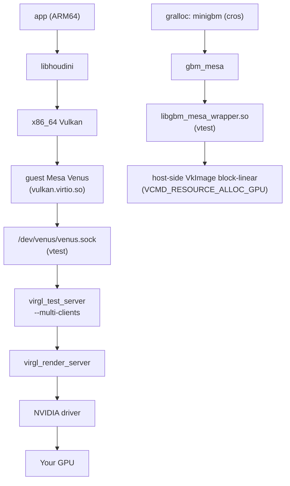

# Requirements
**nvidia-drm.modeset=1**: required for `dmabuf` to work;
**nvidia-open** kernel modules, not proprietary, version **595.71+** (**610.xx** is recommended);
Available **/dev/udmabuf** (`boot.kernelModules = [ "udmabuf" ];` on **NixOS**);
Nix package manager

The `venus.service` daemon checks the driver version, udmabuf, and modeset at runtime before initialization — before launching redroid, verify via journalctl that the preflight check hasn't produced any errors.

# How to use outside of NixOS?
Install the **Nix** package manager from the official [NixOS](https://nixos.org/download/) website

# Why Venus instead of the open Mesa stack (nouveau+nvk+zink)?
The open stack for NVIDIA is still fairly young despite its progress. It delivers on average 70–80% of native proprietary driver performance, and it does build for Android via the NDK — but SurfaceFlinger still doesn't handle zink and nvk properly. Proprietary drivers with open kernel modules (nvidia-open) give native performance, and Venus has almost no overhead (see below).

# What's the performance cost?
Venus itself is just a Vulkan command serializer (encoder/decoder), not a source of overhead. The overhead comes from the transport: with classic virtio-gpu on top of a real VM, that means vmenter/vmexit switches between guest and host, plus extra hypervisor layers. In vtest mode (used here), the transport is a lightweight unix-socket IPC on the same host with no VM boundary — which is why overhead stays under 10%.

The path for an x86_64 host looks roughly like this:

# libhoudini
`flake.nix` includes two versions of **libhoudini** — from **ChromeOS Nissa R134** and **ChromeOS Brya R145**. The former is stable; the latter is a fallback whose reliability and stability are unknown. It's recommended to first test **libhoudini** from **ChromeOS Brya R145** (especially on **AMD** CPUs), since it's one of the most recent versions for Android 13.

# Contribution
Open an issue and submit a PR if you think something could be improved.

# License
Licensed under **MIT**.
